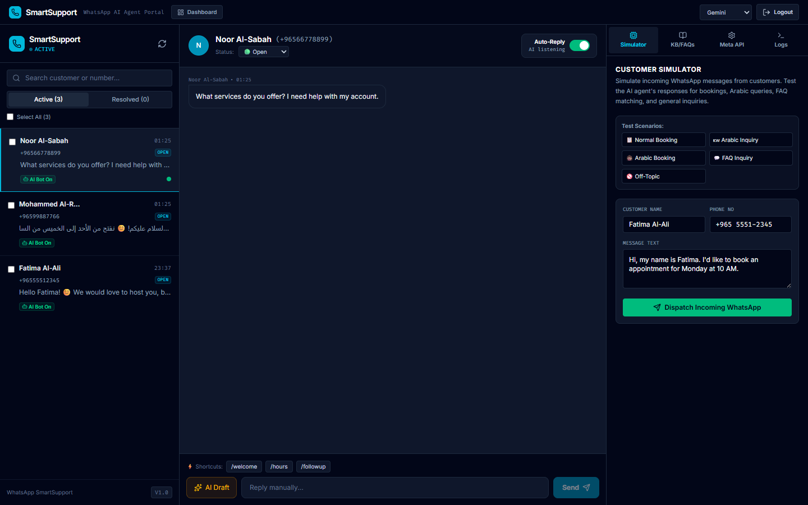

# WhatsApp SmartSupport

AI-powered multilingual WhatsApp customer support platform for any business. Not just a FAQ/booking bot — a full-stack prototype with CRM integration, real-time admin dashboard, and no-code per-client customization via the built-in AI configuration panel. Handles appointment booking, bilingual FAQ responses, and HubSpot CRM sync — all through WhatsApp messaging.


## Features

- **WhatsApp Webhook Integration** — receives and responds to customer messages via the Meta WhatsApp Cloud API (Graph API v25)
- **Multilingual AI** — Gemini and DeepSeek LLM providers with automatic language detection and translation (Arabic ↔ English), plus bilingual FAQ keyword matching
- **Appointment Booking** — NLP-driven booking flow with duplicate prevention, day restrictions, cancel/reschedule support (persisted in SQLite)
- **FAQ Knowledge Base** — CRUD-manageable FAQs via the admin dashboard with bilingual keyword matching (hours, location, services, pricing, etc.)
- **HubSpot CRM Sync** — auto-creates/updates contacts in HubSpot on every incoming message, with intelligent contact reason detection (urgent, complaint, booking, pricing, greeting, etc.)
- **No-Code Client Customization** — edit system prompt, business context, reply tone, and confidence thresholds directly from the admin dashboard; switch LLM providers (Gemini/DeepSeek/Rule) with a dropdown
- **Configurable Guardrails** — content safety checks for prompt injection, abuse, off-topic, and unsafe advice detection
- **Admin Dashboard** — React SPA with thread management, appointment list, contacts, webhook logs, message simulator, and AI config panel
- **SSE Live Updates** — dashboard refreshes in real-time without polling



## Quick Start

**Prerequisites:** Node.js 18+

```bash
npm install
```

Copy the environment template and fill in your keys:

```bash
cp .env.example .env
```

**.env** — required variables:

| Variable | Description |
|---|---|
| `GEMINI_API_KEY` | Google Gemini API key (required for LLM) |
| `DEEPSEEK_API_KEY` | DeepSeek API key (optional fallback provider) |
| `GEMINI_MODEL` | Gemini model name (default: `gemini-flash-latest`) |
| `APP_URL` | Public URL where the app is hosted |
| `HUBSPOT_ACCESS_TOKEN` | HubSpot private app token (optional CRM sync) |
| `WEBHOOK_VERIFY_TOKEN` | Token used by Meta to verify the WhatsApp webhook endpoint |

Run the app:

```bash
npm run dev
```

The server starts at `http://localhost:3000`. Access the admin dashboard at the root URL.

## Project Structure

```
├── backend/
│   ├── ai/            # Response engine, guardrails, translation
│   ├── db/            # SQLite store + in-memory seed data
│   ├── integrations/  # HubSpot CRM sync
│   ├── routes/        # Express routes (webhooks, threads, admin, knowledge)
│   └── utils/         # Phone normalization, logging
├── src/               # React frontend (Vite + Tailwind CSS)
│   └── types.ts       # Shared TypeScript types
├── docs/              # Project overview, prompt rules, cost estimates
├── .env.example       # Environment variable template
├── docker-compose.yml # Docker deployment with env var references
└── server.ts          # Express entry point
```

## Client Customization

Customize the AI for any business without touching code — everything is configurable from the admin dashboard (`/`):

1. Open the **KB/FAQs** panel in the right sidebar
2. Edit **Business Description** (the system prompt — defines behavior, rules, and context)
3. Set **Company Name**, **Reply Tone** (hospitable, professional, friendly, casual, supportive)
4. Adjust **Confidence Threshold** for auto-replies (50%–90%)
5. Add/remove FAQs with bilingual keywords via the CRUD form
6. Switch **LLM Provider** (Gemini / DeepSeek / Rule-Based) from the top nav dropdown
7. Save — all changes take effect immediately without restarting the server

> The system prompt written in the dashboard is persisted to `docs/prompt-behavior-rules.md` — easily version-controlled or hand-edited for advanced prompt engineering.

## WhatsApp Setup

1. Create a Meta Business App with WhatsApp product
2. Configure the webhook callback URL: `https://<APP_URL>/api/whatsapp/webhook`
3. Set the verify token to match `WEBHOOK_VERIFY_TOKEN` in your `.env`
4. Subscribe to `messages` webhook field
5. Add your phone number to the app's test numbers, or go live with a verified Business

## Docker

```bash
docker compose up -d
```

All secrets are passed via environment variables — no keys are hardcoded in the compose file. Persistent data (SQLite) and logs are stored in Docker volumes.

## Tech Stack

- **Backend:** Express.js, better-sqlite3, Google GenAI SDK, DeepSeek API
- **Frontend:** React 19, Vite, Tailwind CSS
- **AI/ML:** Gemini, DeepSeek (dual-provider with runtime toggle), bilingual translation (Arabic/English)
- **Integrations:** WhatsApp Cloud API v25, HubSpot CRM (contact sync with reason detection)
- **Infrastructure:** Docker, Docker Compose
